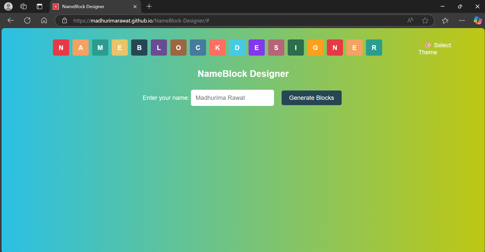

# NameBlock-Designer
NameBlock-Designer is a web-based tool for creating personalized name blocks with customizable colors and dynamic themes. Users can download their designs as images, and the tool is fully responsive, providing a seamless experience on all devices.

<a href="https://madhurimarawat.github.io/NameBlock-Designer/"> </a>

<a href="https://madhurimarawat.github.io/NameBlock-Designer/">
  
</a>

<br>

<a href="https://madhurimarawat.github.io/NameBlock-Designer/">
  
</a>

---

## Features
- **Dynamic Block Creation**: Converts each character of the entered name into a colorful block.
- **Customizable Colors**: Allows individual color selection for each block.
- **Automatic Coloring**: Provides a one-click option to apply a preset color palette.
- **Image Download**: Lets users save their creations as PNG images.
- **Gradient Background**: Apply gradient effects to the website’s background, without affecting the saved transparent PNG image.
- **Multiple Themes**: Includes various themes for an engaging user experience, such as:
  
  - **🌅 Sunset Vibes**
  - **🌊 Ocean Breeze**
  - **🌙 Lavender Dream**
  - **🍃 Green Freshness**
  - **🔥 Fiery Passion**
  - **🌇 Golden Hour**
  - **🚢 Calm Seas**
  - **💖 Peachy Pink**
  - **🍂 Autumn Leaves**
  - **🌌 Mysterious Night**
  - **☁️ Pastel Dream**
  - **🌴 Tropical Paradise**
  - **🌫️ Purple Haze**
  - **🍓 Berry Blast**
  - **🌤️ Silver Lining**
  - **🌬️ Cool Breeze**
    
---

## Directory Structure
```plaintext
NameBlock-Designer/
|
├── index.html                 # Main HTML structure of the application
├── css/
│   └── index.css              # CSS file for styling the webpage
├── js/
│   └── index.js               # JavaScript file for interactivity and functionality
└── images/
    ├── Logo.png                      # Application logo
    ├── NAMEBLOCK DESIGNER_NameBlock.png  # Main illustration created using the tool
    └── Designed Name_Transparent.png     # Example with transparent background
```

---

## Usage

1. Open `index.html` in a browser.
2. Enter your desired name in the input field.
3. Use the color pickers to customize individual block colors or apply the preset palette using the **Auto Colors** button.
4. Optionally, choose a theme from the available options, such as **Sunset Vibes** or **Ocean Breeze**. This step does not affect the result; the output will be a transparent PNG image with name blocks in the selected colors and white letters inside the blocks.
5. Download your design as a transparent PNG image by clicking **Download Image**.
6. Use the generated name blocks in your portfolio, personal cards, or other projects. For inspiration and examples, visit [my portfolio](https://madhurimarawat.github.io/Portfolio-Website/) and [my GitHub profile](https://github.com/madhurimarawat). The project is deployed at [NameBlock-Designer Live](https://madhurimarawat.github.io/NameBlock-Designer/), or you can download and run it locally.

---

## Preview of Creations

**Design Examples:** *Main illustration created using the tool.*


**Design Examples Transparent:** *Example with transparent background.*


---

## Technologies Used
- **HTML5**: For structuring the web application.
- **CSS3**: For styling and responsive design.
- **JavaScript**: For interactivity and dynamic content.
- **html2canvas**: For capturing the design and saving it as an image.

---

## Website Design

<a href="https://madhurimarawat.github.io/NameBlock-Designer/">
  
</a>
<br><br>
<a href="https://madhurimarawat.github.io/NameBlock-Designer/">
  
</a>
<br><br>
<a href="https://madhurimarawat.github.io/NameBlock-Designer/">
  
</a>
<br><br>
<a href="https://madhurimarawat.github.io/NameBlock-Designer/">
  
</a>
<br><br>
<a href="https://madhurimarawat.github.io/NameBlock-Designer/">
  
</a>
<br><br>
<a href="https://madhurimarawat.github.io/NameBlock-Designer/">
  
</a>
<br><br>
<a href="https://madhurimarawat.github.io/NameBlock-Designer/">
  
</a>
<br><br>
<a href="https://madhurimarawat.github.io/NameBlock-Designer/">
  
</a>
<br><br>
<a href="https://madhurimarawat.github.io/NameBlock-Designer/">
  
</a>

---

## Additional Notes

- Explore more frontend development projects in my repository: [Website-Frontend-Development](https://github.com/madhurimarawat/Website-Frontend-Developement).  
- [NameBlock-Designer](https://github.com/madhurimarawat/NameBlock-Designer) is the tool I used to create vibrant name blocks. I generated these blocks, made them transparent using [Remove.bg](https://www.remove.bg/), and added them to my [portfolio website](https://madhurimarawat.github.io/Portfolio-Website/).  
- Visit my portfolio for more creative work: [Portfolio Website](https://madhurimarawat.github.io/Portfolio-Website/).  
- Try the live demo of NameBlock-Designer: [NameBlock-Designer Live Demo](https://madhurimarawat.github.io/NameBlock-Designer/).

---

## Contributing
Contributions are welcome! Feel free to fork the repository and submit a pull request.

## License
This project is licensed under the [MIT License](LICENSE).

---

## Thanks for Visiting 😄

- Drop a 🌟 if you find this repository useful.<br><br>
- If you have any doubts or suggestions, feel free to reach me.<br><br>
📫 How to reach me:  &nbsp; [](https://www.linkedin.com/in/madhurima-rawat/) &nbsp; &nbsp;
<a href ="mailto:rawatmadhurima@gmail.com"> </a><br><br>
- **Contribute and Discuss:** Feel free to open <a href= "https://github.com/madhurimarawat/NameBlock-Designer/issues">issues 🐛</a>, submit <a href = "https://github.com/madhurimarawat/NameBlock-Designer/pulls">pull requests 🛠️</a>, or start <a href = "https://github.com/madhurimarawat/NameBlock-Designer/discussions">discussions 💬</a> to help improve this repository!
